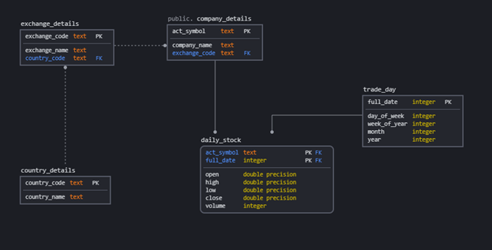

# Capstone Project

## Steps Required to run the project.
1. Ensure Python3 is intalled on your machine
2. Ensure Spark > 2.3.0  is installed
3. Ensure Postgres is installed in the machine that is executing the project.
4. Setup your database connections in the main.py (Lines 9 and 10 and 21 and 22)
5. Download `s3://capstoneudacityde/data/` from s3 to your local machine and place the data inside the project main directory.
6. Execute the command `py main.py`

## Step 1: Scope the Project and Gather Data
### Data for Capstone
The data I am going to be using is a combination of data sets from different stock exchanges (predominantly focused on US markets)
The project will attempt to join the related markets data together and build a data model that contains time, ticker (stock price), company details, market exchange data and country data together to form a mini data warehouse.
There are about 17M rows of tick data that are available across the four exchanges and the project could be extended by including other markets data but the only publicly available data I could find were the four exchanges I have included in the project.

### Use cases 
This data has a couple of use cases that could be namely analytics to allow people to make better proactive decisions based on their data.
It could be using in a machine learning exercise as there is enough data to train various ML models with some level of prediction capability.
This could also serve as a source of truth for an API that is going to be used to service clients with stock related information.

# Step 2: Data Exploration
## Data Issues and cleaning steps
The data is mostly all available (no missing records) – there are however assumptions made from some of the data sets that cannot be made when working on the data in the way this project is going to use it.
1.	The nyse-listed_json.json file does not have an exchange_code which will make it hard to identify what those object’s exchange is from a relational perspective.  I am going to append the static code of ‘n’ to all rows in the data once loaded as to improve the completeness of the data set.
2.	I have removed duplicated days from all the of the ticker (stock) data as there are many repeats in this set as many companies will trade on a single day through the distinct method in spark.
3.	There are also overlaps between the sets of data in the two exchange data files – those duplicate records will not help with any analysis or ML work as it may give bad results.  I will be running a drop duplicates to ensure that those records are not recorded twice.
4.	This will also be done for the companies themselves although on investigation it does not look like there are any overlapping companies.
5.	The files are created as [company.country.txt] I am going to be using the spark capability to read in the file name as an appended column so that I have the company name inside the dataframe row that it belongs to.
6.	I have stuck to a lowercase + underscore naming convention for all the database tables and as such many of the columns that I am receiving with spaces and capital letters are going to be transformed to match what is expected.

# Step 3: Data Model
## ERD 

This structure was used as it allows relationships between objects to be made and create more effective features for machine learning as well as easier build out of analytics work via existing relationships (in tools such as powerBI/Clickview)

## Pipeline steps
•	Create Spark Session
•	Load raw tables from source
•	Create stocks dataframe for NYSE
•	Create stocks dataframe for Others
•	Union Stock Tables and rename columns
•	Create date table from execution date
•	Create time PSQL Table
•	Clean stock PSQL Table
•	Create the stock  PSQL Table
•	Union the companies from the two different stock tables
•	Clean the company table
•	Create last three tables (company_details, country_details, exchange_details)

## Please View the word doc to review the Data Dictionary. 

# Step 5: Complete Project Write Up
The only query that will need to be run is the main.py unless someone wants to review the scripts details in which case it would be a good idea to go over the notebook attached.
The model makes sense as there are specific things that are going to be run more than once but mostly actions are only happening once and so it would be inefficient to load those single pieces of work into anything but the main() method.
Spark does a good job at doing ETL especially across multiple files and different formats. It is also effective over large datasets and as a result was the most logical solution to the problem of loading 17M rows of data.
Cleaning was easy to accomplish due to spark and required minimal complex methods.
The data could be updated at varying frequencies depending on the nature of the project.  The suggestion would be to run it at end of day as the data is currently being run as an end of day batch.
Improvements might be made to make better real time predictions from an ML perspective and in that case you may want to include kafka and run spark streaming to load the data.  
The other thing to consider in terms of data loading is that this was a once off load but you could run an airflow script that is connected to a VM or a hosted service which loads data on a daily basis when the file is expected to be running.  
The last consideration would be to build an event driven architecture that uses a lambda function that will trigger on the release of a file into an s3 bucket.

How you would approach the problem differently under the following scenarios:
- If the data was increased by 100x.
--	This would simply require me to move the spark job from my laptop onto a redshift cluster with relatively more resources.  I believe the code is already quite efficient and using the correct technology to do the work.
- If the pipelines were run on a daily basis by 7am.
--	An airflow script that is connected to a VM or a hosted service which loads data on a daily basis when the file is expected to be running (7am).  
--	The other consideration would be to build an event driven architecture that uses a lambda function that will trigger on the release of a file into an s3 bucket.
- If the database needed to be accessed by 100+ people.
--	I would not allow 100 people direct access to the database I would prefer to put an API and a load balancer for the API in front of the database that give people a more effective method of connecting to the database.  There is not need for direct access to the database as the purpose of the code is to do all the loading itself the only thing that users would need to do would be to read the results which would be better served via an API that could potentially also cache results that are commonly requested via the API.

